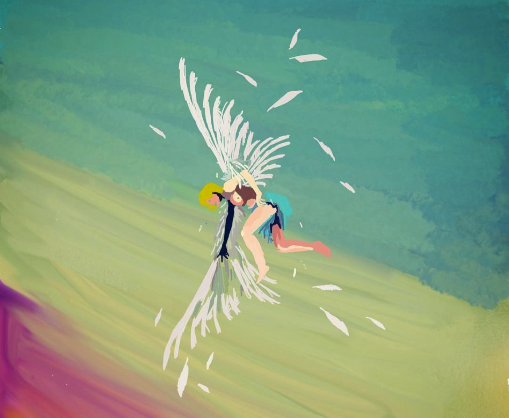

I admire this Indie artist from Ireland, a lot.

My first song by EDEN (Jonathan Ng / Jon) was [Wake Up](https://open.spotify.com/track/6K6OCvFQ4i7KKfGJsOAqY1?si=728e5803cd4445a9) posted by Suicide Sheep on YouTube. As a teen I was very excited about studying in America and the lyrics deeply resonated with me. [^1]

Then, a few months went by without a lot of exploration and Wake Up was one of my songs on repeat. I dabbled a little in *i think you think too much of me* and *End Credits.* I was then unaware that Jon was also behind The Eden Project.

Things really changed after the Vertigo album was released, and it changed my life. I noticed how the artist is keen on details such as the audience voices in love; not brave from vertigo, the female voice in crash - is actually him. I am obsessed with the idea of falling, *falling in reverse* really hit me. I enjoy glass smashing samples in music and I love the way he incorporates it into his music and storytelling. The song also inspired me to make this piece of digital art.

Most of my art is inspired from the ideas I have had while jamming to his music.

As someone really crazy about even the minute details (careful, the devil is in them) I appreciated the fact that EDEN really planned out everything in his music. I then dived into this entire world to imagine and experience the effort put into producing music. As I grew up, I understood the deep meaning and his melancholic expression of the mundane things in life. He is also very sneaky, sometimes goes uncredited in songs such as [Follow by ZES](https://open.spotify.com/track/0USkfjn6fgZ52cEi1gWMKp?si=60c72a9d9b204adb), [thinking 2 much by Jeremy Zucker](https://open.spotify.com/track/3X0J4QzAMCoyMZUSMCoVDw?si=0a817cd011674a91).

As time passes, you start appreciating the artist for more than his work. I admire the style, graphic design and his yearly videos. I spend my new year’s eve refreshing the Youtube feed to check if he has released a new video. It is in the vertigo world tour video - I first heard the synth samples for rushing from no future. The song gives me immense pleasure and makes me feel at peace.

The album art for End Credits: [Project Viewfinder](http://www.jamessaulsky.com/the-viewfinder-project). Then, the entire no future project with blocks of squares across the project.

I am thankful that the [r/eden](https://www.reddit.com/r/eden/) subreddit exists and I get to catch the glimpses of the tours around the world. The community is also very lovely and wonderful - they know what brings all of us together. 

His music taste and inspirations from Frank Ocean  and Yung Lean are evident in his music as well as his Spotify playlists. In a way, it is EDEN that got me into Frank Ocean and Yung Lean - as well as started appreciating other Indie artists such as Jeremy Zucker and Chelsea Cutler. I have made this shift from bass-heavy EDM to an Indie Pop genre - something very similar to the shift in genre by Jon in his music production.

It is these little things and the details in the way EDEN explores the world with his music is exactly the reason I love his work. Thank you Jon, for making the time go a little easier.

If you want to explore the [entire discography.](https://mcmxcv.fandom.com/wiki/The_Eden_Project_discography#Discography)



[^1]: "Things are better in America, Heard the streets are gold there"
